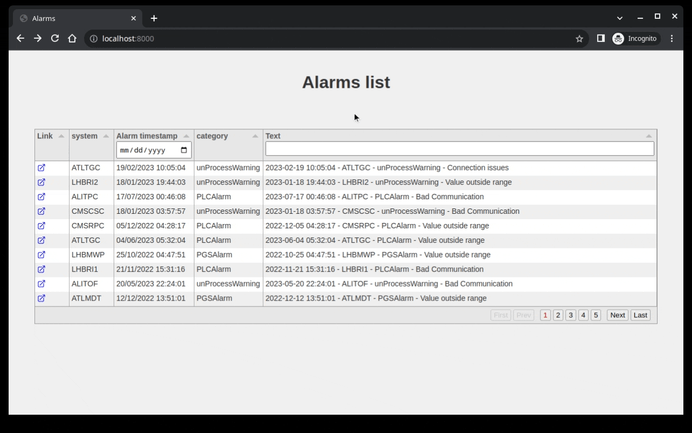

# tabulator-sql-fastapi-demo
Display data from a sql source using Tabulator and python FastAPI

This sample repo aims shows how to use an SQL data source (sqlite in this case) together with
python's FastAPI in the backend and Tabulator js on the frontend to visualize and filter data
in a powerful table.



# How to run the project locally
This project was intentionally kept simple on the frontend and as such it doesn't require any 
external javascript library except from tabulator and luxon.js (required by tabulator for date/time
handling). The sources are loaded from a CDN resource so the only requirements is a recent version 
of python (at the moment of writing python 3.7+ required from FastAPI)
You can then: 

1. Clone this repo
2. Install the python's requirement on your environment using pip (it is recommended that you create a new, local, dedicated virtual environment for this application):
```sh
pip install -r requirements.txt
```
3. Populate an sqlite database with dummy data:
```sh
cd app && python db.py
```
4. Run the webserver with uvicorn:
```sh
uvicorn app.main:app --reload
```